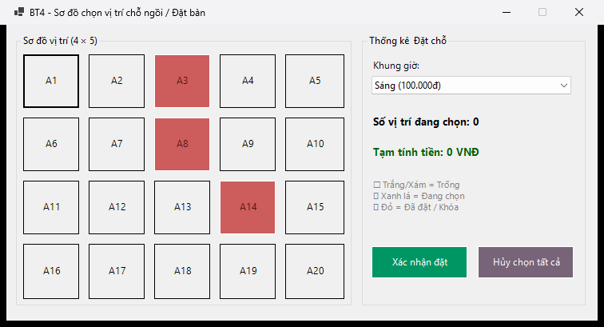
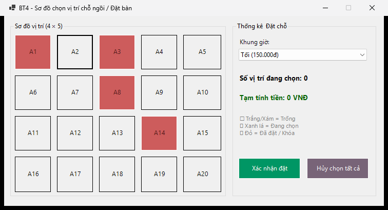
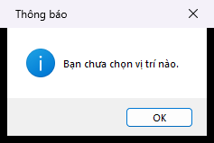

# BÁO CÁO BÀI TẬP / ĐỒ ÁN

## THÔNG TIN SINH VIÊN

- **Họ và tên:** Phạm Tuấn Thành
- **Mã số sinh viên:** 24810320264
- **Lớp:** D19QTANM1
- **Tên môn học:** Lập trình C# / Windows Forms
- **Tên bài tập:** Bài 4 — Sơ đồ chọn vị trí chỗ ngồi / Đặt bàn

---

## KẾT QUẢ THỰC HÀNH

Ảnh chụp từ ứng dụng chạy thực tế trên Windows trong lần kiểm thử ngày **08/10/2026**.

### 1. Ảnh màn hình Giao diện chính



Sơ đồ 20 vị trí theo ma trận 4 hàng × 5 cột; A3, A8 và A14 là các vị trí mẫu đã khóa.

### 2. Ảnh màn hình Chức năng thực thi / Kết quả



Sau khi xác nhận đặt A1, vị trí này chuyển sang màu đỏ và bị khóa; số chỗ đang chọn trở về 0.

### 3. Ảnh màn hình Kiểm tra lỗi (Validation)



Bấm Xác nhận đặt khi chưa chọn vị trí: chương trình thông báo “Bạn chưa chọn vị trí nào.”

---

## MÔ TẢ BÀI TẬP

Chọn và đặt chỗ trên sơ đồ 20 vị trí, tính tiền theo khung giờ.

- TableLayoutPanel có 4 hàng × 5 cột; vòng for tạo 20 Button trong MainForm_Load.
- Toàn bộ 20 nút gán chung Seat_Click; handler bỏ qua vị trí đã khóa.
- Xám nhạt: trống; xanh lá: đang chọn; đỏ: đã đặt / khóa.
- Khung sáng 100.000đ/chỗ, tối 150.000đ/chỗ; cập nhật số chỗ và tiền ngay khi chọn, bỏ chọn hoặc đổi giờ.
- Xác nhận đặt chuyển ghế sang đỏ và khóa; Hủy chọn tất cả chỉ bỏ lựa chọn hiện tại.
- Tách trạng thái bằng HashSet, không dùng màu làm nguồn dữ liệu; gọi Load nhiều lần không sinh trùng nút.

## ĐỐI CHIẾU YÊU CẦU

| Mã | Nội dung đã triển khai | File chính |
|---|---|---|
| R4-1 | TableLayoutPanel có 4 hàng × 5 cột; vòng for tạo 20 Button trong MainForm_Load. | `MainForm.cs` / `MainForm.Designer.cs` |
| R4-2 | Toàn bộ 20 nút gán chung Seat_Click; handler bỏ qua vị trí đã khóa. | `MainForm.cs` / `MainForm.Designer.cs` |
| R4-3 | Xám nhạt: trống; xanh lá: đang chọn; đỏ: đã đặt / khóa. | `MainForm.cs` / `MainForm.Designer.cs` |
| R4-4 | Khung sáng 100.000đ/chỗ, tối 150.000đ/chỗ; cập nhật số chỗ và tiền ngay khi chọn, bỏ chọn hoặc đổi giờ. | `MainForm.cs` / `MainForm.Designer.cs` |
| R4-5 | Xác nhận đặt chuyển ghế sang đỏ và khóa; Hủy chọn tất cả chỉ bỏ lựa chọn hiện tại. | `MainForm.cs` / `MainForm.Designer.cs` |
| R4-6 | Tách trạng thái bằng HashSet, không dùng màu làm nguồn dữ liệu; gọi Load nhiều lần không sinh trùng nút. | `MainForm.cs` / `MainForm.Designer.cs` |

## CÁCH MỞ VÀ CHẠY

Yêu cầu Windows, .NET 10 SDK và Visual Studio 2026 có workload **.NET desktop development**.

1. Mở `SlotBooking.sln` bằng Visual Studio 2026.
2. Nhấn **F5** để chạy ứng dụng.
3. Để thiết kế UI: chọn `MainForm.cs` trong Solution Explorer → **Shift+F7** hoặc **View Designer**.
4. Trong Designer, **Ctrl+Alt+X** mở Toolbox. **F7** trở về code.

Chạy bằng terminal tại thư mục repo:

```powershell
dotnet restore SlotBooking.sln
dotnet build SlotBooking.sln
dotnet run --project src/SlotBooking/SlotBooking.csproj
```

UI tĩnh nằm trong `MainForm.Designer.cs`; xử lý sự kiện nằm trong `MainForm.cs`; tài nguyên form nằm trong `MainForm.resx`.

## HƯỚNG DẪN SỬ DỤNG

1. Bấm vào ghế trống để chọn; bấm lại để bỏ chọn.
2. Chọn khung giờ sáng hoặc tối; 2 ghế tương ứng 200.000đ hoặc 300.000đ.
3. Bấm **Xác nhận đặt** để đặt và khóa ghế; **Hủy chọn tất cả** để bỏ các ghế đang chọn.

## KIỂM THỬ

Build bản sửa trên Windows: **0 lỗi, 0 cảnh báo**. Đã chạy 12/12 kiểm tra đạt với vi-VN.

Xem [bảng kiểm thử](./docs/TESTING.md) và [kết quả chạy](./docs/test-results.json). Kết quả tự động không thay thế việc kiểm tra kéo thả Designer và thao tác GUI ở mọi mức DPI.

## GIẢ ĐỊNH VÀ PHẠM VI

A3, A8, A14 là ghế mẫu đã khóa. Ghế đã đặt bị khóa trong lần chạy hiện tại, dùng chung cho hai lựa chọn giá; chưa có cơ sở dữ liệu đặt chỗ theo ngày/giờ.

## QUY TRÌNH NỘP VÀ PUSH

Repo đã được khởi tạo trên nhánh `main` và liên kết `origin`. Sau khi thay đổi code, README hoặc screenshot, chạy:

```powershell
git config user.name "Pham Tuan Thanh"
git config user.email "tuanthanhpham206@gmail.com"
git status
git add .
git commit -m "Nop bai tap BT4 - MSSV 24810320264 - Pham Tuan Thanh"
git push -u origin main
```

`.gitignore` bỏ qua `bin/`, `obj/`, `.vs/`, `*.user`, `*.suo`. Đăng nhập bằng Git Credential Manager; không đặt token trong URL remote hoặc mã nguồn.

## CHECKLIST TRƯỚC KHI NỘP

- [x] README có họ tên và MSSV.
- [x] README đã điền lớp D19QTANM1.
- [x] `screenshots/` có đủ 3 ảnh chạy thực tế.
- [x] Ảnh hiển thị trực tiếp trên trang chính GitHub.
- [x] `.gitignore` loại tệp build và cấu hình cá nhân của Visual Studio.
- [x] Repository Public.
- [x] Mã nguồn, README và ảnh đã commit/push lên nhánh `main`.
